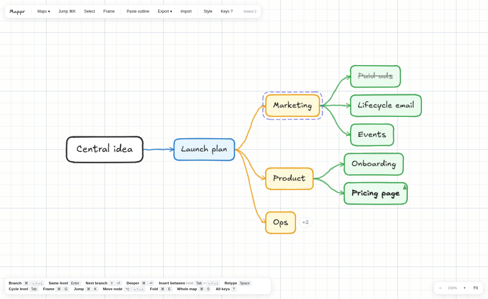

# Mappr

A keyboard-first mindmap app in one HTML file. No build server, no install, no
network. Open `index.html` and start typing.

The point of it is speed: how fast you can create a branch and name it. Every
control is a key, the layout tidies itself after every keystroke, and the camera
follows you so you never have to stop and pan.



---

## Run it

```
open index.html
```

That is the whole thing. It works from a `file://` URL, offline, with the font
and the icon embedded. Your maps live in that browser's `localStorage`.

## Give it to someone else

Send them the hosted link. On first visit the service worker caches the app, so
it keeps working with no network, and the browser offers to install it: an
`Install` button appears in the bar on Chromium, and on iOS it is Share, then
Add to Home Screen. Installed, it opens in its own window with no browser
chrome. Their maps are saved in their own browser and never leave their device;
there is no account and no server holding anything.

When a new version is deployed, the worker fetches it in the background and an
`Update ready` button appears. Nothing reloads until they press it, so an update
can never interrupt a sentence.

Sending the `index.html` file itself still works too, and needs no server at
all. That copy just will not update.

## Build it

`index.html` and `sw.js` are generated. Do not edit them by hand.

```
python3 build.py        # src/app.html + assets/ -> index.html, src/sw.js -> sw.js
```

The build only substitutes tokens:

| token | becomes |
| --- | --- |
| `__FONT_B64__` | base64 of `assets/Excalifont-Regular.woff2` |
| `__ICON_B64__` | base64 of `assets/icon.svg` |
| `__VERSION__` | contents of `VERSION` (in the app, and as the worker's cache name) |

Edit `src/app.html`, run `python3 build.py`, reload the browser.

The PNG icons are generated too, but only when the mark itself changes:

```
node tools/make-icons.mjs     # assets/icon.svg -> icons/*.png
```

## Test it

```
npm install                   # once: playwright
npm test                      # behaviour
npm run test:pwa              # install and offline
npm run bench                 # performance
```

`smoke.mjs` drives real key events in headless Chromium and checks the resulting
tree shape, the layout (no overlapping nodes at any setting), the camera, the
outline round-trip, frames, the SVG/PNG export, the storage layout and its
migration, and that the incremental painter lands in the same place as a full
rebuild. It prints a summary and exits non-zero on failure. Run it before every
commit; it has caught several real bugs that were invisible on screen.

`pwa.mjs` serves the repo over http, then checks the manifest and icons, that
the service worker takes control, and that the app still boots offline.

`bench.mjs` reports render cost, the save round-trip, the cost of creating one
node and how much the undo stack holds, at several map sizes. Run it before and
after anything that touches rendering or storage; `--json out.json` writes the
numbers out so two runs can be compared.

If Chromium is not where Playwright expects it, set `CHROMIUM` first:

```
CHROMIUM=/path/to/chromium node tests/smoke.mjs
```

---

## How it is put together

One file, one IIFE, no dependencies. Roughly in reading order:

| Section | What lives there |
| --- | --- |
| **Spread** | `SPREAD` maps each mode to the list of directions handed to the root's children in order. `spreadDirs()` derives `edir` for the whole tree each layout and `dirOf()` is the single source of truth everywhere else. Nothing is written into the nodes until `takeOverSpread()`, which fires only when a branch is placed against the mode. |
| **Settings** | `DEFAULTS` / `CFG`, the palettes, and the size / spacing tables. Every visual choice in the app is a key on `CFG`. |
| **Model** | `state = { rootId, nodes, frames }`. A node is `{id, parent, children[], text, dir, collapsed, mark}`. `dir` is `L`/`R`/`U`/`D` and governs which way its subtree grows. |
| **Mutations** | `addNode`, `removeNode`, `branch`, `navigate`, undo/redo snapshots. |
| **Layout** | A tidy-tree. `measureSubtree` computes cross-axis extents, `placeSubtree` assigns centres, `layout()` runs it once per direction group out of the view root. Pure function of `box` (measured DOM sizes) and `CFG`. |
| **Drawing** | Hand-drawn geometry: `wline` wobbles a line, `roughRect` a rectangle, `hachure` a fill. All seeded per element id so shapes never shimmer between renders. |
| **Render** | `render()` syncs DOM nodes, measures them, lays out, then `paint()` regenerates the whole SVG in one `innerHTML` write. |
| **Camera** | `cameraTo` keeps the active node inside a comfort rect and leads in the direction of growth. `fitAll` / `fitHere`. |
| **Frames** | A frame is just `{id, title, roots[]}`. Its rectangle is recomputed from its members' positions every render, so it can never go stale. |
| **Export** | `shapes()` is shared by the screen and the exporter. `textSvgFor` walks DOM ranges to recover wrapped line boxes and emits real `<text>`, so exported SVG keeps live text. |
| **Panels** | Style panel is generated from the `PANEL` array. Jump palette, map library, export menu. |
| **Persistence** | `localStorage`: `mappr.index` holds `{current, docs:{id:{name,count,updated}}}` and each map is its own `mappr.doc.<id>` key, so saving one map never touches the others. A map is named after its centre node. Pre-0.8 `mappr.lib` libraries are split on first open. |
| **Install** | Manifest, service worker registration, the `Install` and `Update ready` buttons. Inert on `file://`. |

### Three rules worth knowing before you change anything

1. **The panels must never take the keyboard.** Every floating panel calls
   `preventDefault()` on `mousedown`. Break this and clicking a setting
   mid-sentence kicks you out of the node you were typing in.
2. **Children inherit their parent's `dir`.** Only the root (and a focused node)
   branches in four directions. `layout()` passes one direction down a whole
   subtree, so a node whose stored `dir` disagrees with its branch will render in
   the wrong place. `setDirDeep` exists for exactly this.
3. **Anything a shape's appearance depends on belongs in its cache key.** Drawing
   is cached per shape and each shape keeps its own SVG element, keyed on
   position, measured size, colour, mark and a generation counter that `applyCss`
   bumps on every settings or theme change. Add a new visual input without adding
   it to the key and the old shape will quietly stay on screen. `tests/smoke.mjs`
   checks the incremental paint against a full rebuild, which is the cheapest way
   to catch that.

### Node size and layout

Nodes are real HTML `div`s, so the browser does the text wrapping and the boxes
size themselves. Everything else (boxes, arrows, frames, selection) is SVG drawn
underneath at the measured positions. That split is why text editing feels
native and the drawing still looks hand-made.

---

## Keys

Press `?` in the app for the full list. The ones that matter:

| | |
| --- | --- |
| `⏎` | new node beside this one, same level |
| `⇧⏎` | same level, next branch along |
| `⌘⏎` | a child, one level deeper |
| `⌘←↑→↓` | branch in a direction; same direction again goes deeper |
| hold `Tab` + arrow | insert a node *in between* (backtrack, add a parent layer) |
| arrows | walk the tree; while typing they commit and move |
| `Tab` | cycle every node at the same level |
| `Space` | retype the selected node |
| `⌥←↑→↓` | move the node itself: reorder, promote, demote |
| `⌘E` | fold / unfold a branch |
| `⌘K` | jump to any node by typing |
| `⌘0` | zoom out to the whole map |
| `⌘G` | wrap the selection in a frame |
| `⌘C` / `⇧⌘C` | copy as outline / as an image |
| `⌘,` | style panel |

Mouse: right-click a node to focus into it, right-click empty canvas to step
back out. On a Mac that is a two-finger click or ctrl-click. Double-click a node
to retype it.

Copied outlines carry both flavours too: plain text as an indented bullet list,
and html as real `<ul>`/`<li>` nesting, so a paste into a document or a wiki
lands as nested bullets rather than flat lines.

Pasted outlines: both clipboard flavours are parsed and whichever recovered more
structure wins. The `text/html` flavour is the reliable one, because it keeps
real `<ul>`/`<li>` nesting that the plain text often loses entirely. Falling back
to text: indentation by spaces, tabs or the invisible Unicode spaces
rich-text copies use; `-` `*` `+` `>` `•` `◦` `▪` and numbered bullets; markdown
headings. A copy that arrives with no indentation at all, which is what Word and
Google Docs produce, is nested by bullet glyph instead, in their documented
order. Glyphs are only consulted when indentation says nothing, so an indented
outline is never overridden.

---

## Roadmap

Not built yet, roughly in the order worth doing:

- [ ] Frame-aware layout, so a frame is a real container and outside nodes cannot
      drift into its rectangle
- [ ] Node notes: a longer body behind a short label
- [ ] Presentation mode: step through branches one at a time
- [ ] Speed instrumentation (nodes per minute, keystrokes per node) to actually
      measure the thing this app exists to test
- [ ] Cheaper `beginEdit`. Since 0.8 it is the single most expensive step in
      creating a node in a large map (~40ms at 1500 nodes), more than the render
      it follows; the cost is in activating `contenteditable` and moving the
      selection, not in the layout
- [ ] Images inside nodes
- [ ] A real file format and cross-device sync, if this ever ships

## Deploying

The repo root is the site. `vercel.json` sets `buildCommand` to `python3 build.py`
and `outputDirectory` to `.` explicitly: without them Vercel picks up the `build`
script in `package.json`, runs it, then fails looking for a `public/` directory
that this project does not have.

The headers in the same file are what make the installable app work in
production. `sw.js` and the manifest are served `max-age=0, must-revalidate`,
which matters more than it looks: a service worker cached by a CDN pins every
visitor to that version permanently, with no way to push a fix.

Connect the GitHub repo in Vercel rather than deploying from the CLI. The CLI
uploads a snapshot and keeps serving it, so the site silently goes stale behind
`main`.

## Versioning

Semver, tagged. `VERSION` is the single source of truth: the build stamps it into
the app (visible in the corner of the keys dialog) and uses it as the service
worker's cache name, so a release invalidates the old cache and installed copies
pick the new build up. Bump `VERSION`, rebuild, update `CHANGELOG.md`, commit,
then tag:

```
git tag -a v0.8.0 -m "…"
git push --follow-tags
```
